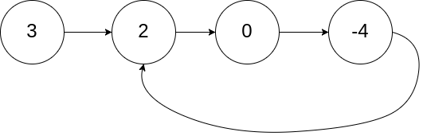
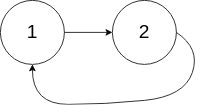

# 141. Linked List Cycle

- **Difficulty:** Easy
- **Categories:** Hash Table, Linked List, Two Pointers
- **Link:** https://leetcode.com/problems/linked-list-cycle
- **Tutorial:** https://www.youtube.com/watch?v=gBTe7lFR3vc

## **Description:**

Given `head`, the head of a linked list, determine if the linked list has a cycle in it.

There is a cycle in a linked list if there is some node in the list that can be reached again by continuously following the `next` pointer. Internally, `pos` is used to denote the index of the node that tail's `next` pointer is connected to. **Note that `pos` is not passed as a parameter.**

Return `true` if there is a cycle in the linked list. Otherwise, return `false`.

## **Examples:**

**Example 1:**
- **Input:** head = [3,2,0,-4], pos = 1
- **Output:** true
- **Explanation:** There is a cycle in the linked list, where the tail connects to the 1st node (0-indexed).

**Example 2:**
- **Input:** head = [1,2], pos = 0
- **Output:** true
- **Explanation:** There is a cycle in the linked list, where the tail connects to the 0th node.

**Example 3:**
- **Input:** head = [1], pos = -1
- **Output:** false
- **Explanation:** There is no cycle in the linked list.

## **Constraints:**

- The number of the nodes in the list is in the range `[0, 10ˆ4]`.
- `-105 <= Node.val <= 105`
- `pos` is `-1` or a **valid index** in the linked-list.

## **Simplified Explanation**:

Set two pointers, `slow` and `fast`, to the head of the linked list. Move `slow` by one step and `fast` by two steps in each iteration. If there is a cycle, `slow` and `fast` will eventually point to the same node. If there is no cycle, `fast` will reach the end of the list. 

NOTE: `slow` and `fast` are node references, not the integer values. The comparison slow == fast checks whether they point to the same node object, not whether slow.val == fast.val. Which is why even if we set two nodes to the same value, they are still different nodes in memory, and the comparison will return false until both pointers land on the exact same node object.