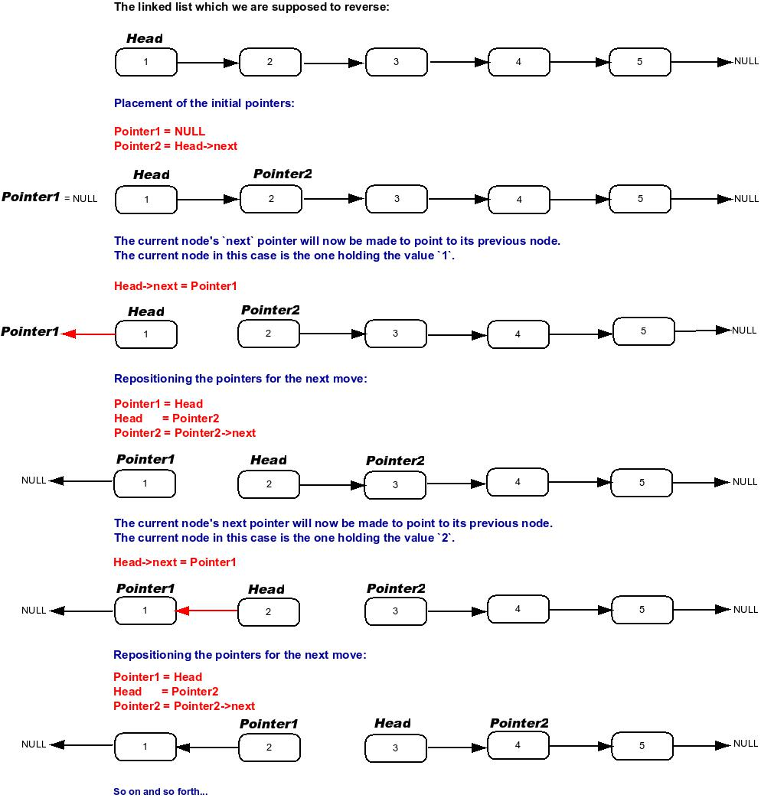

# 206. Reverse Linked List

- **Difficulty:** Easy
- **Categories:** Linked List, Recursion
- **Link:** https://leetcode.com/problems/reverse-linked-list
- **Tutorial:** 

## **Description:**

Given the `head` of a singly linked list, reverse the list, and return *the reversed list*.

## **Examples:**

**Example 1:**
    **Input:** head = [1,2,3,4,5]
    **Output:** [5,4,3,2,1]

**Example 2:**
    **Input:** head = [1,2]
    **Output:** [2,1]

**Example 3:**
    **Input:** head = []
    **Output:** []

## **Constraints:**

- The number of nodes in the list is the range `[0, 5000]`.
- `-5000 <= Node.val <= 5000`

Follow up: A linked list can be reversed either iteratively or recursively. Could you implement both?

## **Simplified Explanation**:

`cur` walks through the list; `prev` trails behind as the new reversed head. Each loop saves the original next node in `temp`, then reverses the link by setting `cur.next = prev`. Move `prev` forward to `cur`, and cur forward to temp. When `cur` becomes `None`, `prev` is the new head of the reversed list. See image below for visual summary.

