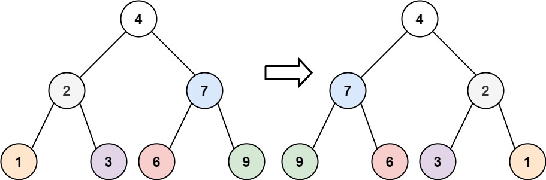
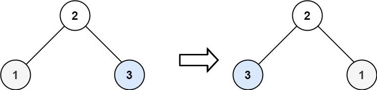

# 226. Invert Binary Tree

- **Difficulty:** Easy
- **Categories:** Tree, Depth-First Search, Breadth-First Search, Binary Tree
- **Link:** https://leetcode.com/problems/invert-binary-tree
- **Tutorial:** 

## **Description:**

Given the `root` of a binary tree, invert the tree, and return *its root*.

## **Examples:**

**Example 1:**

- **Input:** root = [4,2,7,1,3,6,9]
- **Output:** [4,7,2,9,6,3,1]

**Example 2:**

- **Input:** root = [2,1,3]
- **Output:** [2,3,1]

**Example 3:**
- **Input:** root = []
- **Output:** []

## **Constraints:**

- The number of nodes in the tree is in the range `[0, 100]`.
- `-100 <= Node.val <= 100`

## **Simplified Explanation**:

Note: Involves various levels of `inception`-style recursion. Useful to diagram progressive solution to keep track of current recursion level. Important to also keep track of which line of code we left-off at in the previous recursion levels for better understanding.

## Additional Information:

In a binary tree, each node (like `root`, `root.left`, or `root.right`) is itself a `TreeNode` object. Each `TreeNode` has its own `left` and `right` attributes, which can point to other `TreeNode` objects or be `None`.

So, when you write `root.left.left`, you are accessing the left child of the left child of the root. Similarly, `root.right.right` is the right child of the right child of the root.

This works because each node is an object with its own `left` and `right` properties, allowing you to chain them as deep as the tree goes. For example:

- `root.left` is the left child of the root.
- `root.left.left` is the left child of `root.left`.
- `root.right.right` is the right child of `root.right`.

This is how you build or traverse deeper levels in a binary tree structure.