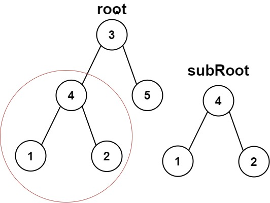
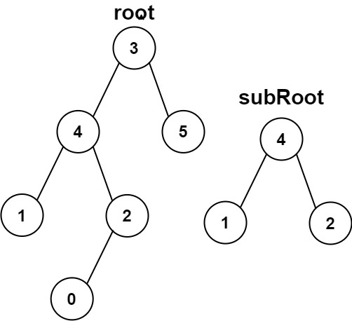

# 572. Subtree of Another Tree

- **Difficulty:** Easy
- **Categories:** Tree, Depth-First Search, String Matching, Binary Tree, Hash Function
- **Link:** https://leetcode.com/problems/subtree-of-another-tree
- **Tutorial:** 

## **Description:**

Given the roots of two binary trees `root` and `subRoot`, return `true` if there is a subtree of `root` with the same structure and node values of `subRoot` and `false` otherwise.

A subtree of a binary tree `tree` is a tree that consists of a node in `tree` and all of this node's descendants. The tree `tree` could also be considered as a subtree of itself.

## **Examples:**

**Example 1:**

- **Input:** root = [3,4,5,1,2], subRoot = [4,1,2]
- **Output:** true

**Example 2:**

- **Input:** root = [3,4,5,1,2,null,null,null,null,0], subRoot = [4,1,2]
- **Output:** false

## **Constraints:**

- The number of nodes in the `root` tree is in the range `[1, 2000]`.
- The number of nodes in the `subRoot` tree is in the range `[1, 1000]`.
- `-104 <= root.val <= 104`
- `-104 <= subRoot.val <= 104`

## **Simplified Explanation**:

Important to consider and handle all edge cases. For example, if sub-tree is empty, return True, because an empty tree is a subtree of any tree. And if root is empty and subRoot is not, return False, because subRoot cannot be a subtree of root. Also inside sameTree(), check if both root and subRoot are None, because that indicates the end of a both trees. Overall a large amount of recursion and nesting to keep track of because all nested nodes and their trees are compared against the subRoot.