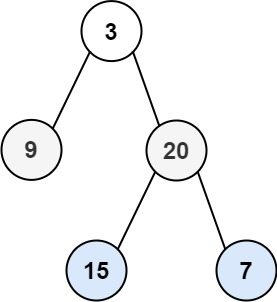

# 102. Binary Tree Level Order Traversal

- **Difficulty:** Medium
- **Categories:** Tree, Breadth-First Search, Binary Tree
- **Link:** https://leetcode.com/problems/binary-tree-level-order-traversal
- **Tutorial:** 

## **Description:**

Given the `root` of a binary tree, return *the level order traversal of its nodes' values*. (i.e., from left to right, level by level).

## **Examples:**

**Example 1:**

- **Input:** root = [3,9,20,null,null,15,7]
- **Output:** [[3],[9,20],[15,7]]

**Example 2:**
- **Input:** root = [1]
- **Output:** [[1]]

**Example 3:**
- **Input:** root = []
- **Output:** []

## **Constraints:**

- The number of nodes in the tree is in the range `[0, 2000]`.
- `-1000 <= Node.val <= 1000`

## **Simplified Explanation**:

Removing and returning current (left-most) node from `q` using popleft(), and then appending new child nodes to `q`, and continually adding the current levels node values to a list, and appending that list to a results list of lists.