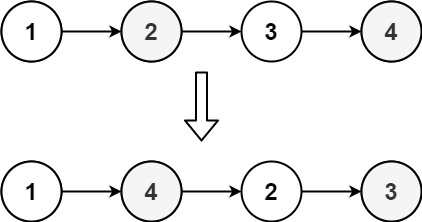
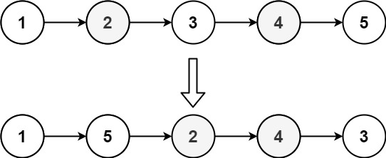

# 143. Reorder List

- **Difficulty:** Medium
- **Categories:** Linked List, Recursion, Two Pointers, Stack
- **Link:** https://leetcode.com/problems/reorder-list
- **Tutorial:** 

## **Description:**

You are given the head of a singly linked-list. The list can be represented as:

```text
L0 → L1 → … → Ln - 1 → Ln
```

Reorder the list to be on the following form:

```text
L0 → Ln → L1 → Ln - 1 → L2 → Ln - 2 → …
```

You may not modify the values in the list's nodes. Only nodes themselves may be changed.


## **Examples:**



**Example 1:**
- **Input:** head = [1,2,3,4]
- **Output:** [1,4,2,3]



**Example 2:**
- **Input:** head = [1,2,3,4,5]
- **Output:** [1,5,2,4,3]

## **Constraints:**

- The number of nodes in the list is in the range `[1, 5 * 104]`.
- `1 <= Node.val <= 1000`

## **Simplified Explanation**:

TIP: Don't think of the list in terms of it's values, instead think of them as nodes and their positions in memory

- **Initial pointers:**
    - first = 1
    - second = 4

- **1st iteration:**
    - tmp1 = first.next = 2
    - tmp2 = second.next = 3
    - first.next = second → 1.next = 4
    - second.next = tmp1 → 4.next = 2
    - Move pointers: first = 2, second = 3

- **2nd iteration:**
    - tmp1 = first.next = None (since 2 was the end of the first half)
    - tmp2 = second.next = None
    - first.next = second → 2.next = 3
    - second.next = tmp1 → 3.next = None
    - Move pointers: first = None, second = None

- **Final list:**
1 → 4 → 2 → 3