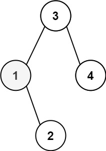
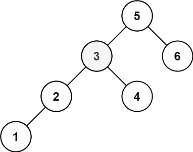

# 230. Kth Smallest Element in BST

- **Difficulty:** Medium
- **Categories:** Tree, Depth-First Search, Breadth-First Search, Binary Tree
- **Link:** https://leetcode.com/problems/kth-smallest-element-in-a-bst
- **Tutorial:** 

## **Description:**

Given the `root` of a binary search tree, and an integer `k`, return *the `kth` smallest value (**1-indexed**) of all the values of the nodes in the tree*.

## **Examples:**

**Example 1:**

- **Input:** root = [3,1,4,null,2], k = 1
- **Output:** 1

**Example 2:**

- **Input:** root = [5,3,6,2,4,null,null,1], k = 3
- **Output:** 3

## **Constraints:**

- The number of nodes in the tree is `n`.
- `1 <= k <= n <= 104`
- `0 <= Node.val <= 104`

## **Simplified Explanation**:

Firstly, we traverse down the left subtree of the binary search tree, adding each node to the stack, until we reach the leftmost node. Then, we pop nodes from the stack, traversing back up the tree, and increment a counter until we find the `kth` smallest node. Finally, we return the value of that node.