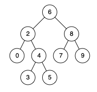

# 235. Lowest Common Ancestor of a Binary Search Tree

- **Difficulty:** Medium
- **Categories:** Tree, Depth-First Search, Breadth-First Search, Binary Tree
- **Link:** https://leetcode.com/problems/lowest-common-ancestor-of-a-binary-search-tree
- **Tutorial:** 

## **Description:**

Given a binary search tree (BST), find the lowest common ancestor (LCA) node of two given nodes in the BST.

According to the definition of LCA on Wikipedia: “The lowest common ancestor is defined between two nodes `p` and `q` as the lowest node in `T` that has both `p` and `q` as descendants (where we allow **a node to be a descendant of itself**).

## **Examples:**

**Example 1:**

- **Input:** root = [6,2,8,0,4,7,9,null,null,3,5], p = 2, q = 8
- **Output:** 6 
- **Explanation:** The LCA of nodes 2 and 8 is 6.

**Example 2:**

- **Input:** root = [6,2,8,0,4,7,9,null,null,3,5], p = 2, q = 4
- **Output:** 2
- **Explanation:** The LCA of nodes 2 and 4 is 2, since a node can be a descendant of itself according to the LCA definition.

**Example 3:**
- **Input:** root = [2,1], p = 2, q = 1
- **Output:** 2

## **Constraints:**

- The number of nodes in the tree is in the range `[2, 10ˆ5]`.
- `-109 <= Node.val <= 109`
- All `Node.val` are **unique**.
- `p != q`
- `p` and `q` will exist in the BST.

## **Simplified Explanation**:

In a BST, the structure is defined by node values: left children are less than the parent, right children are greater. The algorithm doesn't need to know the actual positions or paths to p and q—just their values relative to the current node. We use the values of p and q because the BST property allows us to determine their relative positions in the tree using only their values.