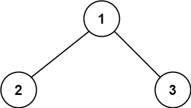
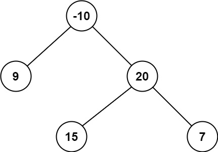

# 124. Binary Tree Maximum Path Sum

- **Difficulty:** Hard
- **Categories:** Dynamic Programming, Tree, Depth-First Search, Binary Tree
- **Link:** https://leetcode.com/problems/binary-tree-maximum-path-sum
- **Tutorial:** 

## **Description:**

A **path** in a binary tree is a sequence of nodes where each pair of adjacent nodes in the sequence has an edge connecting them. A node can only appear in the sequence **at most once**. Note that the path does not need to pass through the root.

The **path sum** of a path is the sum of the node's values in the path.

Given the `root` of a binary tree, return *the maximum **path sum** of any **non-empty** path*.

## **Examples:**

**Example 1:**

- **Input:** root = [1,2,3]
- **Output:** 6
- **Explanation:** The optimal path is 2 -> 1 -> 3 with a path sum of 2 + 1 + 3 = 6.

**Example 2:**

- **Input:** root = [-10,9,20,null,null,15,7]
- **Output:** 42
- **Explanation:** The optimal path is 15 -> 20 -> 7 with a path sum of 15 + 20 + 7 = 42.

**Example 3:**
- **Input:** 
- **Output:** 
- **Explanation:** 

## **Constraints:**

- The number of nodes in the tree is in the range `[1, 3 * 104]`.
- `-1000 <= Node.val <= 1000`

## **Simplified Explanation**:

We traverse the tree from left to right and decide at each level of tree if the max sum is the sum of left and right child + current node value or the max sum is the max of left and right child + current node value. We also keep track of the global max sum at each level of tree. Finally, we return the global max sum as the result.