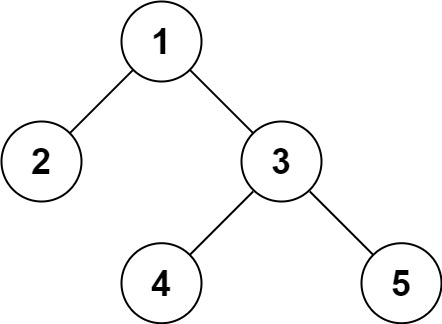

# 297. Serialize and Deserialize Binary Tree

- **Difficulty:** Hard
- **Categories:** String, Tree, Depth-First Search, Breadth-First Search, Design, Binary Tree
- **Link:** https://leetcode.com/problems/serialize-and-deserialize-binary-tree
- **Tutorial:** 

## **Description:**

Serialization is the process of converting a data structure or object into a sequence of bits so that it can be stored in a file or memory buffer, or transmitted across a network connection link to be reconstructed later in the same or another computer environment.

Design an algorithm to serialize and deserialize a binary tree. There is no restriction on how your serialization/deserialization algorithm should work. You just need to ensure that a binary tree can be serialized to a string and this string can be deserialized to the original tree structure.

**Clarification:** The input/output format is the same as how LeetCode serializes a binary tree. You do not necessarily need to follow this format, so please be creative and come up with different approaches yourself.

## **Examples:**

**Example 1:**

- **Input:** root = [1,2,3,null,null,4,5]
- **Output:** [1,2,3,null,null,4,5]

**Example 2:**
- **Input:** root = []
- **Output:** []

## **Constraints:**

- The number of nodes in the tree is in the range `[0, 104]`.
- `-1000 <= Node.val <= 1000`

## **Simplified Explanation**:

Because dfs is nested inside deserialize, it needs a mutable index that all recursive calls can share and update. Using `self.i` makes that index an instance attribute, so every call to dfs reads and increments the same counter.

If you used just `i`, Python would treat it as a local variable inside dfs once you assign to it, which would break unless you wrote nonlocal i. So `self.i` is a simple way to keep the current position in `vals` across the whole recursive walk. A local `i` would only work if you passed it through return values or used nonlocal.